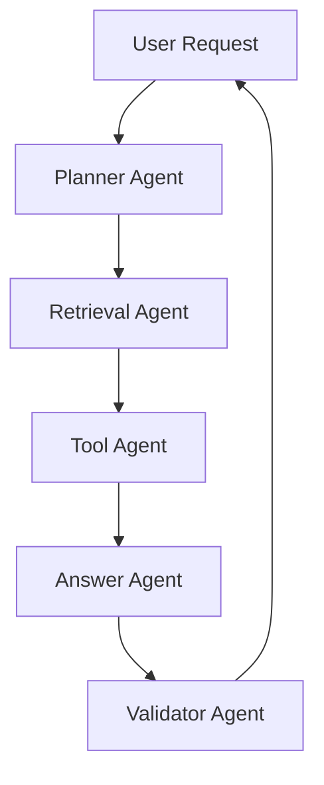

# What Is Multi-Agent RAG?

Multi-Agent RAG combines retrieval-augmented generation with multiple specialized agents instead of a single monolithic assistant.

## Why Multi-Agent

- Better separation of concerns.
- Improved reliability through explicit handoff steps.
- Easier testing per agent capability.
- Better scale for enterprise scenarios.

## Typical Agent Roles

- Planner Agent: decomposes user goal into tasks.
- Retrieval Agent: collects grounded context from sources.
- Reasoning Agent: composes grounded answer.
- Tool Agent: executes APIs or operations.
- Validator Agent: checks completeness, safety, and quality.

## Interaction Pattern

## Example Repositories

- Agentic DevOps AI Shopping: [https://github.com/Cloud2BR-MSFTLearningHub/Agentic-DevOps-AI-Shopping](https://github.com/Cloud2BR-MSFTLearningHub/Agentic-DevOps-AI-Shopping)
- Agentic AI Media Assistant: [https://github.com/Cloud2BR-MSFTLearningHub/Agentic-AI-Media-Assistant](https://github.com/Cloud2BR-MSFTLearningHub/Agentic-AI-Media-Assistant)
